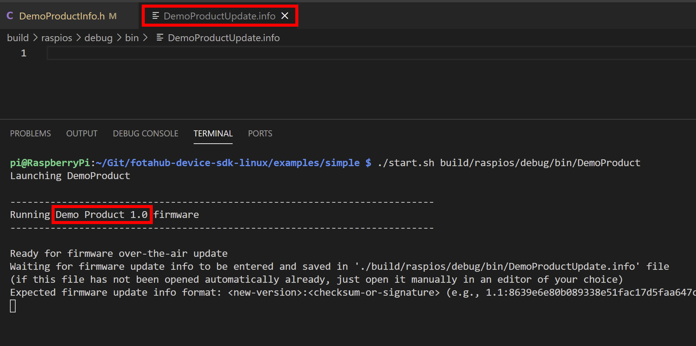
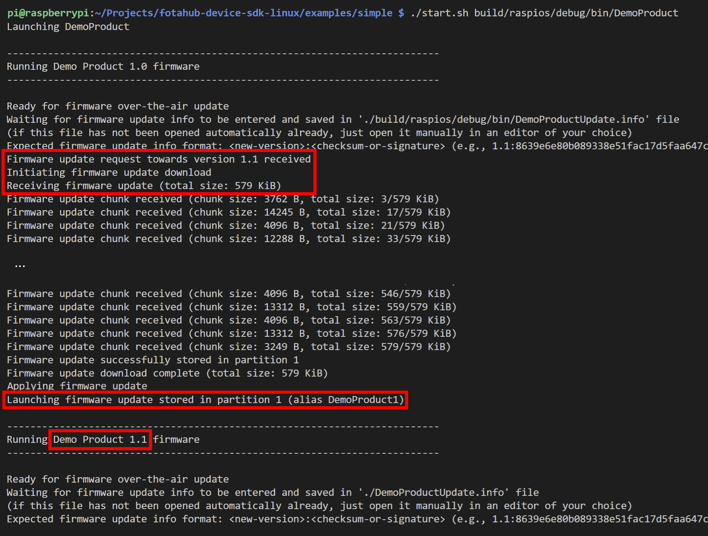

# Simple FOTA update example

The *Simple* example demonstrates the most straight forward manner to make firmware over-the-air updates with FotaHub. It is kind of a "Hello World" example for FOTA updating and a perfect way to get started in that field.

## Operating principle

The goal of this example is to create an executable program that represents an IoT device firmware and demonstrates a full firmware update cycle using FotaHub on a Linux-based device of your choice.

The firmware program is going to be named after the corresponding FotaHub product (e.g., `DemoProduct.exe`) that you will create along the way (or maybe have created already). Right after being launched, it creates and opens a file named `DemoProductUpdate.info` that is located in the same folder as the firmware program. It waits until a firmware update info string is entered and saved in this file. The latter is expected to consist of the new firmware version the device should be updated to followed by a ':' and the checksum of the new firmware version:

`<new-version>:<checksum>` 

e.g., `1.1:a15d5599d8745ff4f51690eb3996afcf75d0b1729d1b8cda2491b03940417521`

Once a valid update info string has been found in the `DemoProductUpdate.info` file and the contained new firmware version is different from the version of the already running firmware program, the firmware update procedure is triggered. It involves your Linux device to connect to FotaHub and download the binary (i.e., the executable program) of the new firmware version. Thereby, it uses a dedicated URL including the id of the product representing the device in FotaHub, and the name and the version of the firmware binary to be retrieved.

The downloaded firmware binary is stored in a new firmware program file that has the same name as the original one followed by an imaginary partition index '1' (e.g., `DemoProduct1.exe`). At the same time, the downloaded firmware binary's checksum gets recalculated and compared to the checksum included in the previously communicated update info string. If both match the firmware update gets activated by loading and executing the new firmware program file as a new child process. This causes the original firmware program to be replaced with a running instance of the new firmware version downloaded from FotaHub.  

## Supported targets

The Simple example can be used as is on any of the targets listed [here](../../README.md#supported-targets).

## Installation

A description of the tools that must be available on your laptop or computer can be found [here](../../README.md#installation).

## Usage

### Create a FotaHub product

Create a FotaHub product for your Linux-based IoT device as explained [here](../fotahub/create-product.md). It will be used to upload and provide firmware updates for the same. 

### Create initial firmware version

1. Start the Visual Studio Code and open (`File > Folder...`) the `Simple` example included in the FotaHub Device SDK for Linux and Raspberry Pi (`<device-sdk-root>\examples\simple`).

> &#x1F6C8; If you intend to run this example on your Raspberry Pi (or a similar single board computer) but don't want to undergo the hassle of connecting keyboard, mouse, monitor, etc. to it, you can perform  the steps described in the following remotely from your desktop computer using SSH. You can achieve that very conveniently by [enabling SSH](https://www.raspberrypi.org/documentation/remote-access/ssh/) on your Raspberry Pi and installing the [*Remote - SSH* extension](https://marketplace.visualstudio.com/items?itemName=ms-vscode-remote.remote-ssh) in Visual Studio Code. Find out more about how to set up and use this feature [here](https://code.visualstudio.com/docs/remote/ssh). 

2. Open the `DemoProductInfo.h` file, and initialize the `DEMO_PRODUCT_ID` and `DEMO_PRODUCT_NAME` constants with the id and the name of the previously created FotaHub product. Leave the `DEMO_PRODUCT_FIRMWARE_VERSION` as is for now. In case you have selected anything else than `SHA256` as the binary checksum algorithm for your FotaHub product, you also must adjust the `DEMO_PRODUCT_FIRMWARE_UPDATE_VERIFICATION_ALGORITHM` constant accordingly:

```c
#define DEMO_PRODUCT_ID "eb8ab3b1-0938-40ec-afba-9379363948cf"

#define DEMO_PRODUCT_NAME "Demo Product"

#define DEMO_PRODUCT_FIRMWARE_VERSION "1.0"

#define DEMO_PRODUCT_FIRMWARE_UPDATE_VERIFICATION_ALGORITHM FOTA_UPDATE_VERIFICATION_ALGORITHM_SHA256
```
   
> &#x1F6C8; You can look up the id of your [FotaHub](https://fotahub.com) product in the `Settings > General` section of the same.

3. Open the integrated terminal (`Terminal > New Terminal...`) and build the example by typing the following command:
   
```bat
make
```

4. You can find the resulting firmware program in the `build/linux/debug/bin` or `build/raspios/debug/bin` folder (using the `Explorer` view). Its name equals the name of the FotaHub product configured in the `DemoProductInfo.h` file without spaces (e.g., `DemoProduct`).

### Create and upload a new firmware version to FotaHub

1. Go back to the `DemoProductInfo.h` file, and bump the `DEMO_PRODUCT_FIRMWARE_VERSION` constant:

```c
#define DEMO_PRODUCT_FIRMWARE_VERSION "1.1"
```

2. Rebuild the example by typing the following command in the integrated terminal:

```bat
make UPDATE=y
```

3. Locate the resulting new firmware program in the  `build/<os>/debug/bin` folder (using the `Explorer` view). Its name is the name of the FotaHub product configured in the `DemoProductInfo.h` file without spaces followed by an `Update` suffix (e.g., `DemoProductUpdate`).
   
> &#x1F6C8; You can locate the new firmware program file also in your filesystem explorer or copy its path to the clipboard using corresponding Visual Studio Code context menu actions (`Reveal in File Explorer`/`Reveal in Finder` and `Copy Path`). When you are running this example on a Raspberry Pi (or a similar single board computer) and remotely accessing it from your desktop computer using the Visual Studio Code Remote SSH extension, you can also find a context menu action for downloading the new firmware program to your desktop computer (`Download...`). This can come quite handy in the subsequent steps.

4. Upload the new firmware program (e.g., `DemoProductUpdate`) as firmware version `1.1` to your FotaHub product as explained [here](../fotahub/upload-firmware.md).

### Make your first firmare over-the-air update 

1. Go back to Visual Studio Code and launch the initial firmware version by typing the following commands in the integrated terminal (use `raspios` as OS when you are working on a Raspberry Pi or `linux` otherwise, and choose the firmware program name according to your FotaHub product name, e.g., `DemoProduct`):

```bat
chmod u+x start.sh
./start.sh build/<os>/debug/bin/<product-name>.exe
```

2. The firmware program prints a banner including the product name and the initial firmware version into the terminal output. It also creates and opens the `DemoProductUpdate.info` file directly in Visual Studio Code (if the latter is not installed on your machine, you will need to open the `DemoProductUpdate.info` file manually in an editor of you choice):
   
 

3. Enter the new firmware version followed by a ':' and the checksum of the same in the `DemoProductUpdate.info` file and save it.

 

> &#x1F6C8; You can find the checksum of the new firmware version by selecting it in the `Details` section of your [FotaHub](https://fotahub.com) product and locating it in the properties of the same.

4. This will trigger the firmware over-the-air update procedure. Upon successful completion, the initial firmware program exits and the new firmware version downloaded from FotaHub is started automatically. To verify that, check the firmware version in the banner being printed into the terminal output:



> &#x26A0; Under certain conditions, it may happen that you encounter an `I/O error during handling of downloaded firmware chunk` right after the firmware over-the-air update procedure has been started. In this case,  check if there are any duplicate instances of the firmware program running on your machine (using `ps -a`). Kill all of them (using `sudo kill 9 <pid>`) and restart the firmware program.